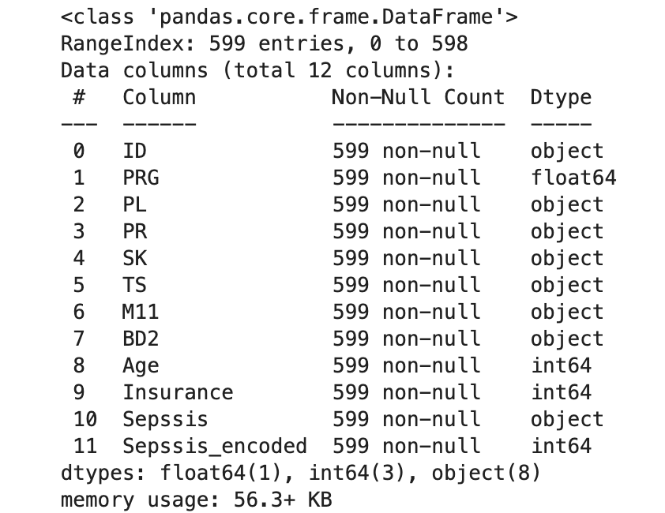
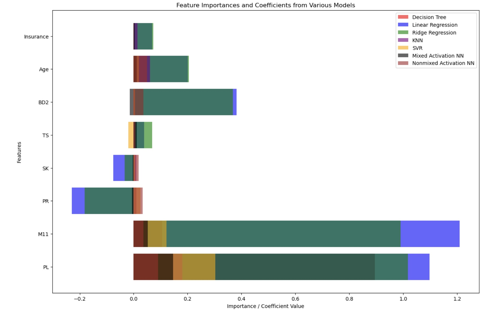
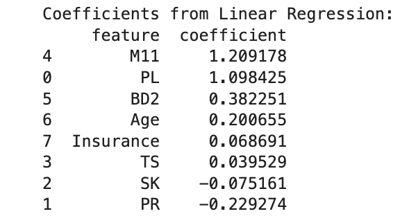
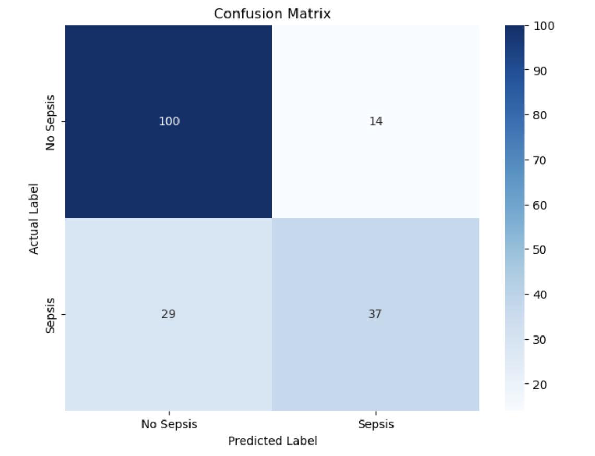

**Problem Statement**  
**Data Understanding**  
**Data Preparation**  
**Methodology** 
**Conclusions** 
**Resources** 

**Problem Statement**

For my capstone assignment I intend to answer the question ***“Can*** 
***you*** ***use*** ***a*** ***patient’s*** ***insurance*** ***status*** 
***to*** ***predict*** ***if*** ***they*** ***will*** ***get*** ***sepsis?”*** 
From the data source page “Sepsis is a life-threatening condition that arises 
when the body’s response to infection causes injury to its own tissues and
organs.”

For the capstone project, I leaned heavily on the work I had done in 
Assignment 20 - Part 1 of the capstone.  I added additional analysis 
leveraging the neural network concepts taught in the final 3 weeks of 
the course.

My expected data source is located on Kaggle
[(<u>link</u>](https://www.kaggle.com/datasets/allanwandia/sepsis)). In
terms of techniques, I used the following modeling approaches

● LinearRegression() 
● KNeighborsRegressor() 
● DecisionTreeRegressor() 
● Ridge() 
● SVR() 
● Neural Network 

For each, I created a model that will enable us to predict the proclivity 
of a patient to getting sepsis using a subset of the Kaggle dataset features.
In this manner, I will not only be able to answer my question on how 
being insured impacts patient ouctomes, but I will also learn about what 
other factors might contribute to patient outcomes with regards to sepsis.  This 
is important because it could help doctors predict the likelihood of a 
patient(s) getting sepsis so they can proactively focus on improving outcomes.

I also tried using a convolutional neural network to build a model
but the model failed to complete its run.  This makes some sense given 
the fact that CNNs traditionally perform well with image data or data that 
has a grid-like structure and the sepsis dataset is neither.

**Data Understanding**

The kaggle data set had several features that I investigated in my
analysis. Features included

● Patient ID 
● The pregnancy status of the patient (0 = not pregnant, 1 = pregnant) 
● The prolactin level of the patient in micro units per milliliter (muU/ml) 
● The pulse rate of the patient in beats per minute (bpm) 
● The skin temperature of the patient in degrees Celsius (°C) 
● The total amount of sweat produced by the patient in milliliters (ml) 
● The body mass index of the patient (BMI) 
● The blood glucose level of the patient in micro units per milliliter (mu U/ml) 
● The age of the patient in years 
● The insurance status of the patient (positive or negative) 

I decided to discard the Patient ID and pregnancy status of the patient.
The patient id (**ID**) was not essential since I wasn't going to be
developing a patient specific model and the pregnancy status (**PRG**)
data column was riddled with anomalies, as it included values that
weren’t 0 and 1.

**Data Preparation**

For some of the **data** **fields**, the data type was “object” so I had
to engineer some features. Specifically, I had to clean some text
strings (typically the unit of the feature). Post clean up of some
fields, I had to convert them to numerical values so that I could use
them in my modeling using ***pd.to_numeric(),*** and then I scaled the
values using **MinMaxScaler()**.

For the **data** **fields**, I encoded the **Sepssis** column as shown
above to convert from “positive” and “negative” values to 1 or 0.
**Sepssis_encoded** was my y value, and X was all other fields after
dropping the **ID**, **PRG**, and **Sepssis** fields.

I then split the X,y data into a training and testing set to use in
assessing the different models.

**Methodology**

Once I had a solid understanding of the underlying dataset and had
encoded the applicable target field, I went about building the different
models, namely Linear Regression, K Nearest Neighbor, Decision Trees,
Ridge, Support Vector Machines (‘rbf’, ‘linear’, and ‘sigmoid’), neural 
network with various hidden node setup and activations, and I attemped to
create a convolutional neural network. 

***GridSearchCV Run*** 
For the Linear Regression, K Nearest Neighbor, Decision Trees, Ridge, and 
Support Vector Machines run, I used the training data set in conjunction 
with GridSearchCV to find the optimal parameters and stored in 4 dictionaries.

● the mean squared error as computed using the test set and prediction
from the **best_estimator\_** *(Please* *note* *I* *had* *to* *round*
*up/down* *the* *probabilities* *to* *get* *a* *binary* *0* *or* *1*
*value)* in the **results_mseerror_grid** dictionary 

● the **best_score\_** for each gridsearch run in the 
**results_bestscore_grid** dictionary 

● the accuracy (*Please* *note* *I* *had* *to* *round* *up/down* *the*
*probabilities* *to* *get* *a* *binary* *0* *or* *1* *value)* in the
**training_results_accuracy_grid** and the **test_results_accuracy_grid**
dictionary 

After completing the GridSearch, I then did a subsequent run with the
optimal parameter(s) for each model to measure the importance of each
feature to the model.

***Neural Network Runs*** 
For the neural network runs, I collected training and validation set accuracies 
along with MSEs for the testing set so it was comparable to the analysis that I 
did in Assignment 20.  In my neural networks, since I was dealing with binary
predictions, I used sigmoid in all my output nodes and I used the binary_crossentropy
loss function when compiling.

For the **Mixed activation** model, I used a 1000 neuron input layer with 'tanh' 
activation, 10000 neuron fully connected hidden layer with 'relu' activation, and 
a singular neuron with 'sigmoid' activation for the output layer.

For the **Nonmixed activation**, I used a 100 neuron input layer with 'relu' 
activation and a singular neuron with 'sigmoid' avtivation for the output layer.

For both neural networks, I played with the number of neurons and the number of 
hidden layers and found them to have very minimal impact in my results, but a huge
impact in my run times.

***Comparison of Models*** 
The bolded **Linear** model performed best.

| Model               | MSE Error      | TrainingAccuracy | TestAccuracy   | TestDiff in Accuracy from Training |
|---------------------|----------------|-------------------|----------------|------------------------------------|
| **Linear** | **0.2388888889** | **0.7780429594** | **0.7611111111** | **-2.18%** |
| KNN                 | 0.3333333333   | 0.7661097852      | 0.6666666667   | -12.98%                            |
| Decision Tree       | 0.2888888889   | 0.768496420       | 0.7111111111   | -7.47%                             |
| Ridge               | 0.2611111111   | 0.7756563246      | 0.7388888889   | -4.74%                             |
| SVR                 | 0.25           | 0.7947494033      | 0.75           | -5.63%                             |
| Mixed activation    | 0.6907750368   | 0.8042959571      | 0.7055555582   | -12.28%                            |
| Nonmixed activation | 0.5629549623   | 0.7637231350      | 0.7166666389   | -6.16%                             |

Overall, the best performing model (lowest mean squared error) I found was
the **linear** model which has the lowest mean squared error of .24.  It
also had the smallest accuracy differences between the training and test run
with a training accuracy of 77.8% vs 76.1% for a difference of just 2.2%.

I was initially excited when I added the **Mixed activation** neural network
model with 1 hidden node as my training accuracy jumped to 80.4% however
the test accuracy was just 70.6% indicating overfitting.  Its MSE also jumped to 
.69.  

The updated feature importance adding in the neural networks is highlighted below.

For the **linear** model specifically, the feature importance is as follows.

meaning the top 5 drivers are
1. The body mass index of the patient (BMI)
2. The prolactin level of the patient in micro units per milliliter (muU/ml)
3. The blood glucose level of the patient in micro units per milliliter (mu U/ml)
4. The age of the patient in years
5. The insurance status of the patient (positive or negative)

**Conclusions**

I created the confusion matrix for the linear model as shown below

One can see that while the linear model is about 76.1% accurate, there
are quite a few false positives and false negatives.  Summary of 
results below

| True Positive (TP) | True Negative (TN) | False Positive (FP) | False Negative (FN) |
|--------------------|--------------------|---------------------|---------------------|
| 37                 | 100                | 14                  | 29                  |

and 

| Metric    | Value          |
|-----------|----------------|
| Accuracy  | 0.7611111111   |
| Precision | 0.7254901961   |
| Recall    | 0.5606060606   |

In conclusion, referring back to the question “Can you use a patient’s insurance 
status to predict if they will get sepsis?”, I wouldn't want to share with patients 
any expectation on outcomes given their insurance status as it has a very 
low feature importance based on the best performing linear model relative to 
the body mass index of the patient and the prolactin level of the patient.  Furthermore, 
for the linear model, the accuracy is only at 76.1%.

**Resources**

Link to github repository: 
[<u>Current Capstone Part 2 (Assignment 24)</u>](https://github.com/kenmotoyama/Assignment24) 
[<u>Current Capstone Part 1 (Assignment 20)</u>](https://github.com/kenmotoyama/Assignment20)
