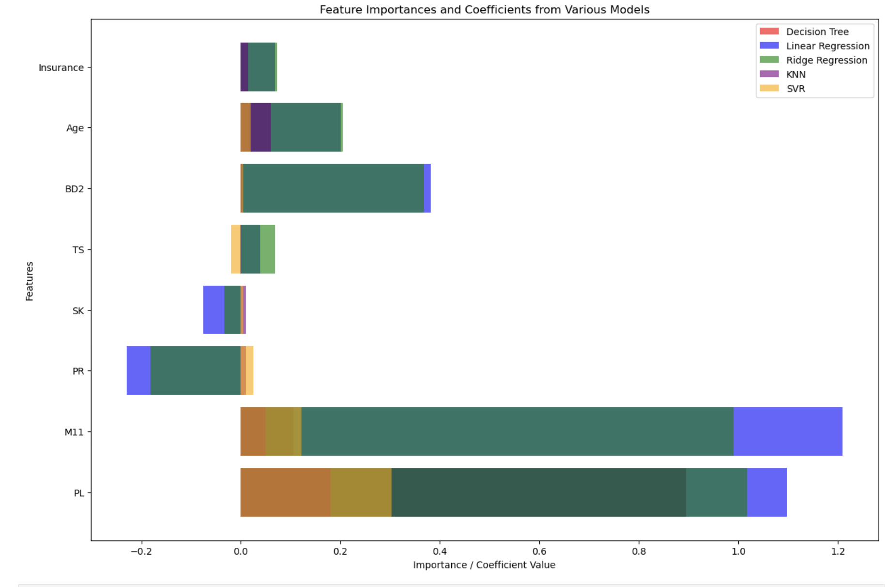
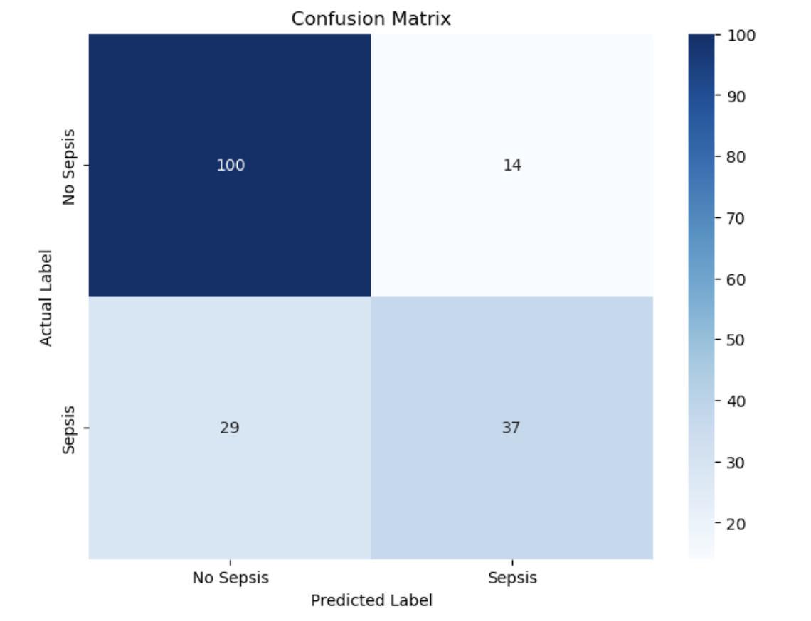

**Problem Statement**  
**Evaluation** 
**Data Understanding**  
**Data Preparation**  
**Methodology** 
**Conclusions** 
**Resources** 

**Problem Statement**

I intend to answer the question ***“Can*** ***you*** ***use*** ***a***
***patient’s*** ***insurance*** ***status*** ***to*** ***predict***
***if*** ***they*** ***will*** ***get*** ***sepsis?”*** From the data
source page “Sepsis is a life-threatening condition that arises when the
body’s response to infection causes injury to its own tissues and
organs.”

For the capstone project, I leaned heavily on the work I had done in 
Assignment 20 - Part 1 of the capstone.  I added additional analysis 
leveraging the neural network concepts taught in the final 3 weeks of 
the course.

My expected data source is located on Kaggle
[(<u>link</u>](https://www.kaggle.com/datasets/allanwandia/sepsis)). In
terms of techniques, I used the following modeling approaches

● LinearRegression() 
● KNeighborsRegressor() 
● DecisionTreeRegressor() 
● Ridge() 
● SVR() 
● Neural Network 
● Convolutional Neural Network 

to create a model that will enable us to predict the proclivity of a
patient to getting sepsis using a subset of the Kaggle dataset features.
This question is important because it could help doctors predict the
likelihood of a patient(s) getting sepsis so they can proactively focus
on improving outcomes.

**Data Understanding**

The kaggle data set had several features that I investigated in my
analysis. Features included

● Patient ID 
● The pregnancy status of the patient (0 = not pregnant, 1 = pregnant) 
● The prolactin level of the patient in micro units per milliliter (muU/ml) 
● The pulse rate of the patient in beats per minute (bpm) 
● The skin temperature of the patient in degrees Celsius (°C) 
● The total amount of sweat produced by the patient in milliliters (ml) 
● The body mass index of the patient (BMI) 
● The blood glucose level of the patient in micro units per milliliter (mu U/ml) 
● The age of the patient in years 
● The insurance status of the patient (positive or negative) 

I decided to discard the Patient ID and pregnancy status of the patient.
The patient id (**ID**) was not essential since I wasn't going to be
developing a patient specific model and the pregnancy status (**PRG**)
data column was riddled with anomalies, as it included values that
weren’t 0 and 1.

**Data Preparation**

For some of the **data** **fields**, the data type was “object” so I had
to engineer some features. Specifically, I had to clean some text
strings (typically the unit of the feature). Post clean up of some
fields, I had to convert them to numerical values so that I could use
them in my modeling using ***pd.to_numeric(),*** and then I scaled the
values using **MinMaxScaler()**.

For the **data** **fields**, I encoded the **Sepssis** column as shown
above to convert from “positive” and “negative” values to 1 or 0.
**Sepssis_encoded** was my y value, and X was all other fields after
dropping the **ID**, **PRG**, and **Sepssis** fields.

I then split the X,y data into a training and testing set to use in
assessing the different models.

**Methodology**

Once I had a solid understanding of the underlying dataset and had
encoded the applicable target field, I went about building the different
models, namely Linear Regression, K Nearest Neighbor, Decision Trees,
Ridge, Support Vector Machines (‘rbf’, ‘linear’, and ‘sigmoid’), neural 
network with various topologies, and a convolutional neural network. For
each run, I used the training data set in conjunction with GridSearchCV
to find the optimal parameters and stored in 3 dictionaries

● the mean squared error as computed using the test set and prediction
from the **best_estimator\_** *(Please* *note* *I* *had* *to* *round*
*up/down* *the* *probabilities* *to* *get* *a* *binary* *0* *or* *1*
*value)* in the **results_mseerror_grid** dictionary 

● the **best_score\_** for each gridsearch run in the 
**results_bestscore_grid** dictionary 

● the accuracy (*Please* *note* *I* *had* *to* *round* *up/down* *the*
*probabilities* *to* *get* *a* *binary* *0* *or* *1* *value)* in the
**results_accuracy_grid** dictionary 

After completing the GridSearch, I then did a subsequent run with the
optimal parameter(s) for each model to measure the importance of each
feature to the model.

**Conclusions**

Overall, the best performing model (low mean squared error) I found was
the **linear** model which has the lowest mean squared error of .239.
Mean squared errors as measured for the GridSearchCV run across all
models are listed below:

> ***'linear':*** ***0.2388888888888889,*** ***'knn':***
> ***0.3333333333333333,*** ***'decision':*** ***0.28888888888888886,***
> ***'ridge':*** ***0.2611111111111111,***
>
> ***'svr':*** ***0.25***

Using accuracy (highest values) gave consistent results as mean squared
error, indicating the **linear** model performed the best. Scores across
all models are listed below

> ***'linear':*** ***0.7611111111111111,*** ***'knn':***
> ***0.6666666666666666,*** ***'decision':*** ***0.7111111111111111,***
> ***'ridge':*** ***0.7388888888888889,*** ***'svr':*** ***0.75***

Please note that the above two analyses required rounding the prediction
up/down to the nearest integer 0 or 1. Using the raw **best_score\_**
from the GridSearch run, I got the following results

> ***'linear':*** ***-0.16119210778470738,***

> ***'knn':*** ***-0.16876902451074138,*** ***'decision':***
> ***-0.163637728632874,*** ***'ridge':*** ***-0.16068009000001543,***
> ***'svr':*** ***-0.16329726451730922***

Using this data, I would conclude that the **ridge** model performed
best.

||
||
||
||
||
||

||
||
||
||
||
||

I also created the confusion matrix for the linear model as shown below

One can see that while the linear model is about 76.1% accurate, there
are quite a few false positives and false negatives.

**Resources**

Link to github repository: ·
[<u>link</u>](https://github.com/kenmotoyama/Assignment20)
